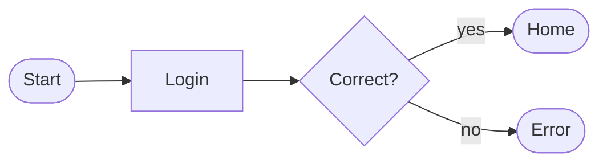
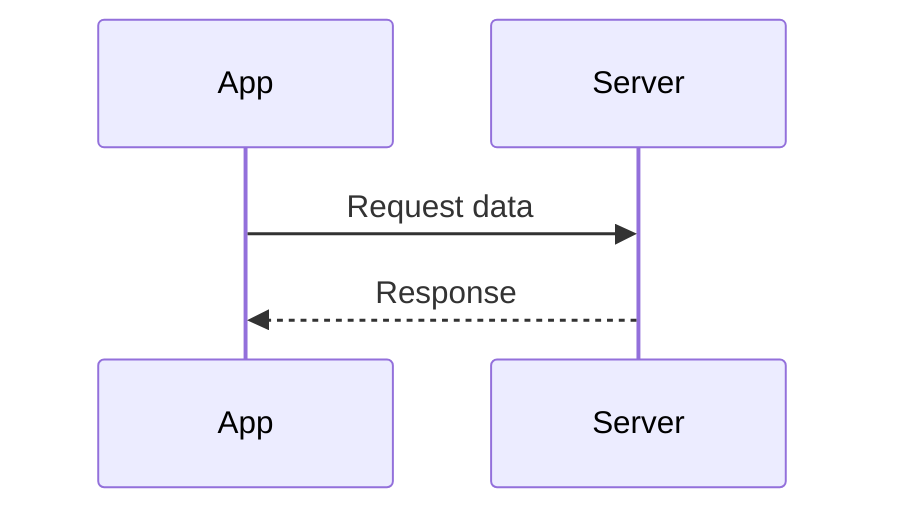
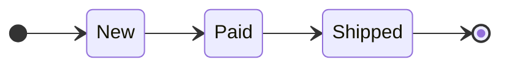
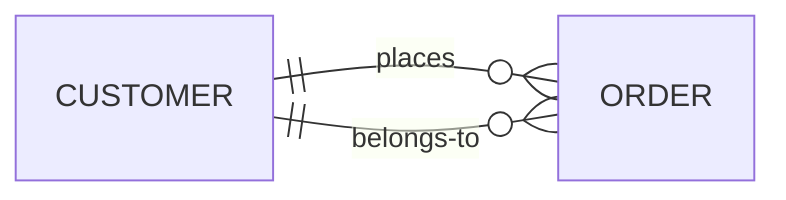
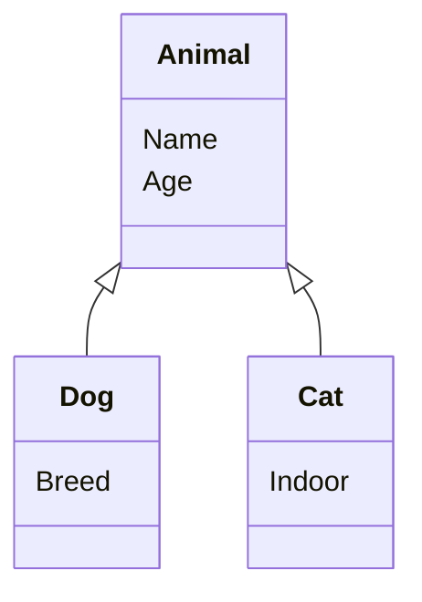
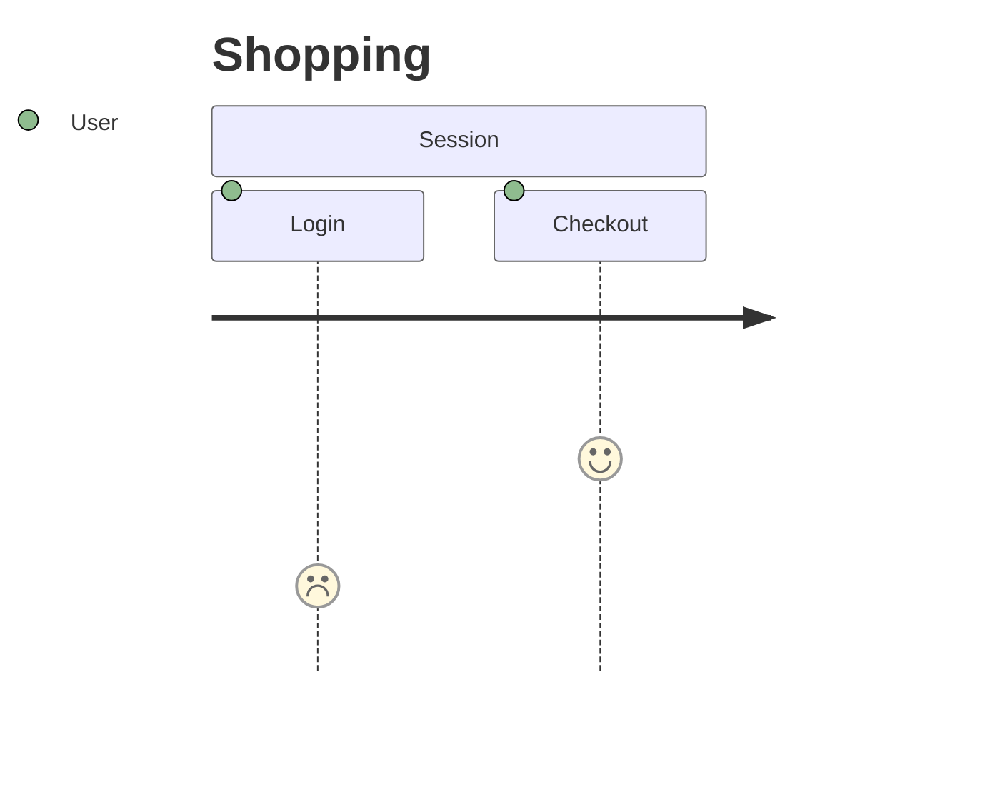
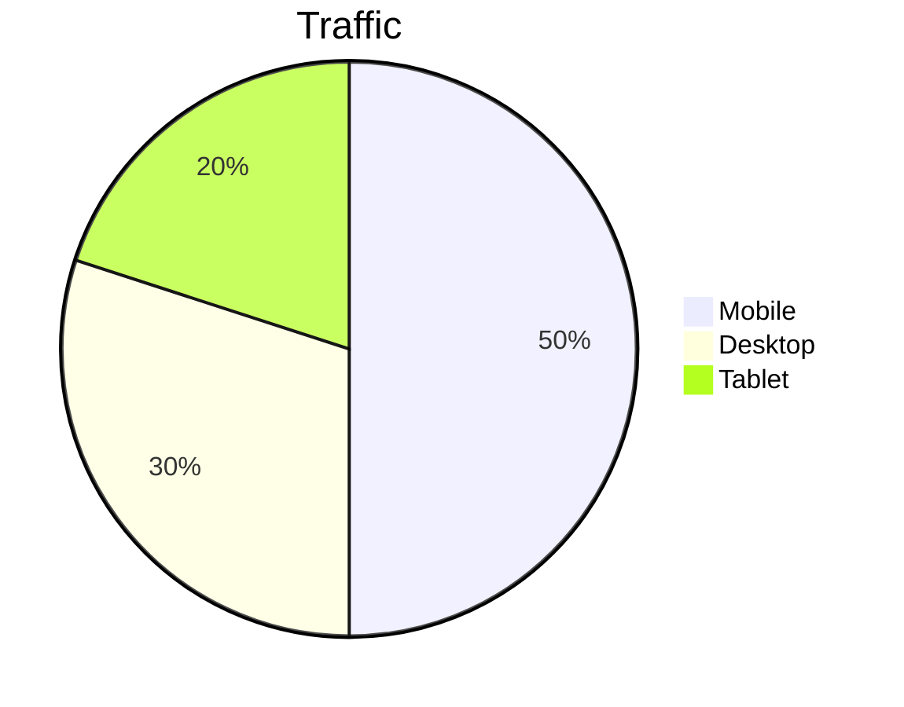

## Callouts

> [!NOTE] Note title
> Lorem ipsum dolor sit amet, consectetur adipiscing elit.

> [!INFO] Info title
> Lorem ipsum dolor sit amet, consectetur adipiscing elit.

> [!IMPORTANT] Important title
> Lorem ipsum dolor sit amet, consectetur adipiscing elit.

> [!SUMMARY] Summary title
> Lorem ipsum dolor sit amet, consectetur adipiscing elit.

> [!WARNING] Warning title
> Lorem ipsum dolor sit amet, consectetur adipiscing elit.

> [!QUESTION] Question title
> Lorem ipsum dolor sit amet, consectetur adipiscing elit.

## Footnotes

Here goes foot note one[^1]. And this references footnote two[^2].

[^1]: Footnote one.
[^2]: Footnote two.

## Tables

Break lines in the cells to prevent auto column width from getting messy.

| Column A | Column B | Column C | Column D |
|---|---|---|---|
| Lorem ipsum | dolor sit | amet consectetur | adipiscing |
| Sed do eiusmod | tempor | incididunt | ut labore |
| Ut enim ad | minim veniam | quis nostrud | exercitation |

| Header one | Header two | Header three |
|---|---|---|
| Foo | Bar | Baz |
| Lorem | Ipsum | Dolor |

## Code snippets

Start each snippet with a comment holding the file name so Shiki renders it as a header above the block.

Inline code snippet: `Templates/Examples.md`

```log
Build succeeded in 2.3s
3 files changed, 0 warnings
```

```json
{
  "name": "vault-sync",
  "version": "1.2.0",
  "watch": true
}
```

```bash
Templates/
├── Daily/       # daily note templates
├── Meeting/     # meeting note templates
│   └── Agenda/  # agenda partials
└── Archive/     # retired templates
```

```cs
// example.cs
public static int Square(int n) => n * n;
```

```kt
// example.kt
fun square(n: Int) = n * n
```

```sh
# example.sh
for file in *.md; do
  wc -l "$file"
done
```

## Mermaid diagrams

Pair a short diagram (1-3 word node labels) with the fuller bulleted description above it - delete any diagram type below that a note doesn't need.

### Flowchart - decision or process flow

- Login checks the password: correct goes to Home, wrong goes to Error.



### Sequence diagram - interaction between parties over time

- App requests data from Server.
- Server replies with the response.



### State diagram - lifecycle or status transitions

- An order starts as New, moves to Paid, then Shipped.



### Entity relationship diagram - data model relationships

- One customer has many orders; each order belongs to one customer.



### Class diagram - structural hierarchy or grouping

- Dog and Cat both extend Animal. Each box lists a few short members - leaving boxes empty renders blank compartments and looks unfinished.



### User journey - user-facing steps and satisfaction

- User opens the app, struggles with Login, succeeds at Checkout.



### Pie chart - proportion or share breakdown

- Mobile makes up most of the traffic, Desktop and Tablet split the rest.



## Children as list
```dataview
LIST
FROM ""
WHERE contains(parent, this.file.link)
SORT file.name ASC
```

## Children as cards
```dataview
TABLE WITHOUT ID 
	file.link AS "Note",
	join(filter(file.tags, (t) => contains(list("#todo", "#open", "#review", "#closed", "#skipped", "#suggestion"), t))) AS "Status"
FROM ""
WHERE contains(parent, this.file.link)
SORT file.name ASC
```

*Add `cssclasses: [cards]` to the note's frontmatter for this to render as a card grid.*
*Can be accompanied by `csssclasses: [card]` to adjust the look of HUB notes and make the cards pop more.*