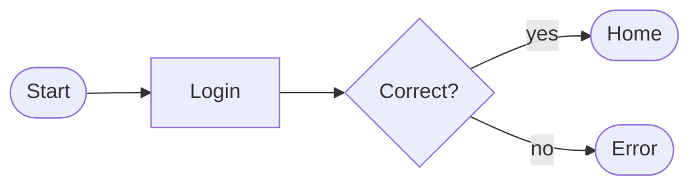
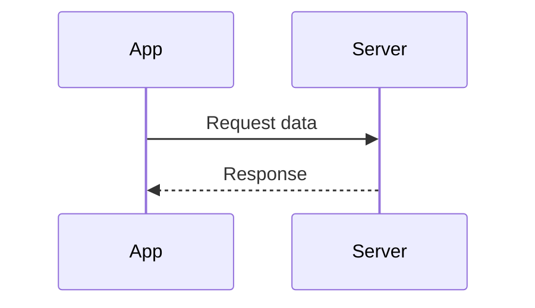
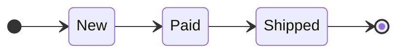
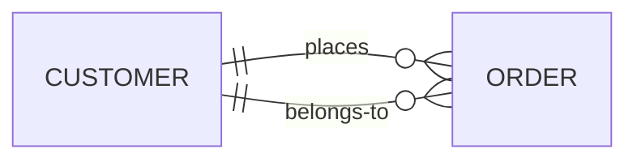
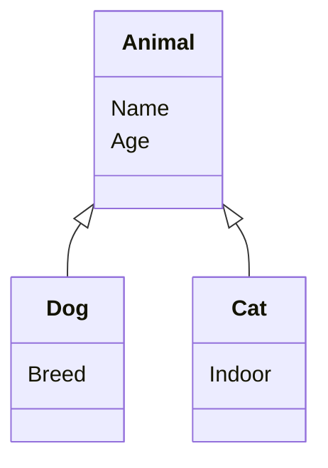
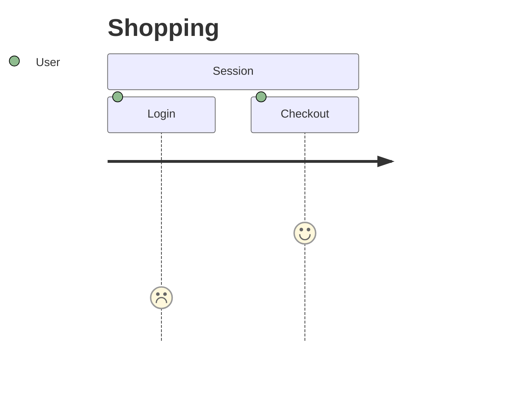
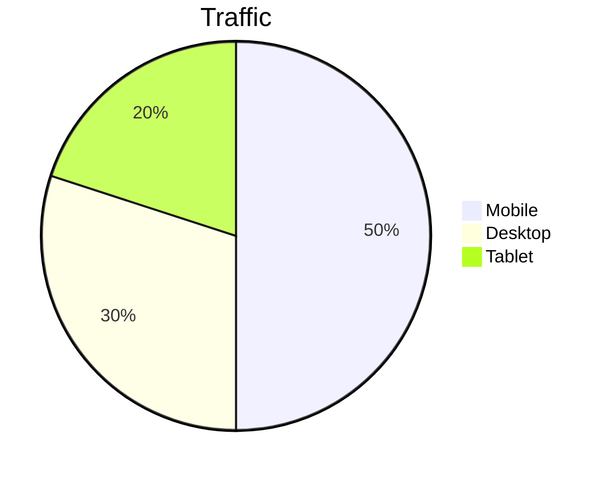
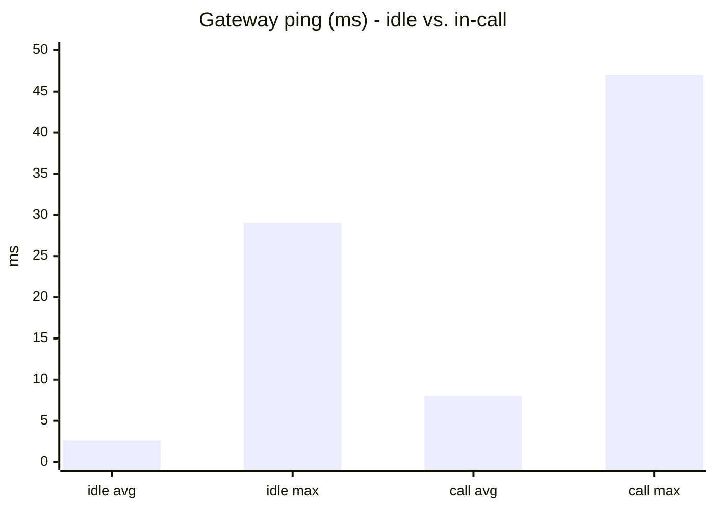
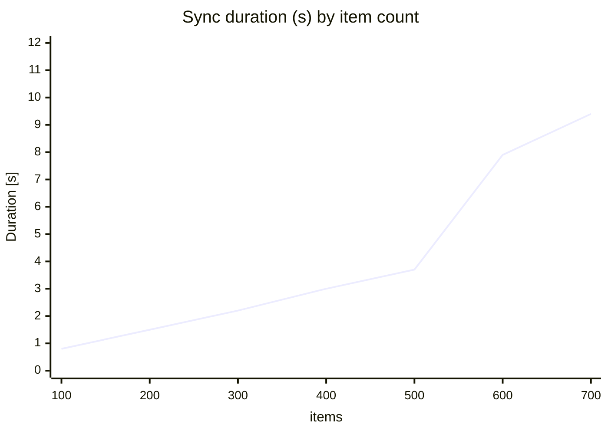

## Callouts

> [!NOTE] Note
> Lorem ipsum dolor sit amet, consectetur adipiscing elit.

> [!INFO] Info
> Lorem ipsum dolor sit amet, consectetur adipiscing elit.

> [!IMPORTANT] Important
> Lorem ipsum dolor sit amet, consectetur adipiscing elit.

> [!SUMMARY] Summary
> Lorem ipsum dolor sit amet, consectetur adipiscing elit.

> [!QUESTION] Question
> Lorem ipsum dolor sit amet, consectetur adipiscing elit.

> [!WARNING] Warning
> Lorem ipsum dolor sit amet, consectetur adipiscing elit.

> [!DANGER] Danger
> Lorem ipsum dolor sit amet, consectetur adipiscing elit.

> [!SUCCESS] Success
> Lorem ipsum dolor sit amet, consectetur adipiscing elit.

> [!FAILURE] Failure
> Lorem ipsum dolor sit amet, consectetur adipiscing elit.

## Footnotes

Here goes foot note one[^1]. And this references footnote two[^2].

[^1]: Footnote one.
[^2]: Footnote two.

## Tables

Break lines in the cells to prevent auto column width from getting messy.

| Column A | Column B | Column C | Column D |
|---|---|---|---|
| Lorem ipsum | dolor sit | amet consectetur | adipiscing |
| Sed do eiusmod | tempor | incididunt | ut labore |
| Ut enim ad | minim veniam | quis nostrud | exercitation |

| Header one | Header two | Header three |
|---|---|---|
| Foo | Bar | Baz |
| Lorem | Ipsum | Dolor |

## Code snippets

Start each snippet with a comment holding the file name so Shiki renders it as a header above the block.

Inline code snippet: `Templates/Examples.md`

```log
Build succeeded in 2.3s
3 files changed, 0 warnings
```

```json
{
  "name": "vault-sync",
  "version": "1.2.0",
  "watch": true
}
```

```bash
Templates/
├── Daily/       # daily note templates
├── Meeting/     # meeting note templates
│   └── Agenda/  # agenda partials
└── Archive/     # retired templates
```

```cs
// example.cs
public static int Square(int n) => n * n;
```

```kt
// example.kt
fun square(n: Int) = n * n
```

```sh
# example.sh
for file in *.md; do
  wc -l "$file"
done
```

## Mermaid diagrams

Pair a short diagram (1-3 word node labels) with the fuller bulleted description above it - delete any diagram type below that a note doesn't need.

### Flowchart - decision or process flow

- Login checks the password: correct goes to Home, wrong goes to Error.


```mermaid
flowchart LR
    Start([Start]) --> Login[Login]
    Login --> Check{Correct?}
    Check -- yes --> Home([Home])
    Check -- no --> Error([Error])
```

### Sequence diagram - interaction between parties over time

- App requests data from Server.
- Server replies with the response.


```mermaid
sequenceDiagram
    App->>Server: Request data
    Server-->>App: Response
```

### State diagram - lifecycle or status transitions

- An order starts as New, moves to Paid, then Shipped.


```mermaid
stateDiagram-v2
	direction LR
    [*] --> New
    New --> Paid
    Paid --> Shipped
    Shipped --> [*]
```

### Entity relationship diagram - data model relationships

- One customer has many orders; each order belongs to one customer.


```mermaid
erDiagram
	direction LR
    CUSTOMER ||--o{ ORDER : places
    ORDER }o--|| CUSTOMER : belongs-to
```

### Class diagram - structural hierarchy or grouping

- Dog and Cat both extend Animal. Each box lists a few short members - leaving boxes empty renders blank compartments and looks unfinished.


```mermaid
classDiagram
    class Animal {
        Name
        Age
    }
    class Dog {
        Breed
    }
    class Cat {
        Indoor
    }
    Animal <|-- Dog
    Animal <|-- Cat
```

### User journey - user-facing steps and satisfaction

- User opens the app, struggles with Login, succeeds at Checkout.


```mermaid
journey
    title Shopping
    section Session
      Login: 2: User
      Checkout: 5: User
```

### Pie chart - proportion or share breakdown

- Mobile makes up most of the traffic, Desktop and Tablet split the rest.


```mermaid
pie title Traffic
    "Mobile" : 50
    "Desktop" : 30
    "Tablet" : 20
```

### XY chart - trend or comparison across categories

- Gateway ping stays low at idle and spikes hardest during calls.


```mermaid
xychart-beta
    title "Gateway ping (ms) - idle vs. in-call"
    x-axis ["idle avg", "idle max", "call avg", "call max"]
    y-axis "ms" 0 --> 50
    bar [2.6, 29, 8, 47]
```

- Sync duration grows with item count and jumps once paging kicks in past 500 items.


```mermaid
xychart-beta
    title "Sync duration (s) by item count"
    x-axis "items" [100, 200, 300, 400, 500, 600, 700]
    y-axis "Duration [s]" 0 --> 12
    line [0.8, 1.5, 2.2, 3.0, 3.7, 7.9, 9.4]
```

## Children as list
```dataview
LIST
FROM ""
WHERE contains(parent, this.file.link)
SORT file.name ASC
```

## Children as cards
```dataview
TABLE WITHOUT ID 
	file.link AS "Note",
	join(filter(file.tags, (t) => contains(list("#todo", "#open", "#review", "#closed", "#skipped", "#suggestion"), t))) AS "Status"
FROM ""
WHERE contains(parent, this.file.link)
SORT file.name ASC
```

*Add `cssclasses: [cards]` to the note's frontmatter for this to render as a card grid.*
*Can be accompanied by `csssclasses: [card]` to adjust the look of HUB notes and make the cards pop more.*

## Ordered cards

- Notes chained through `previous` / `next` properties, numbered by the number of back-hops needed to get to the start.
- Needs `DataviewJS` enabled (`Dataview` settings --> Enable JavaScript Queries).
```dataviewjs
const self = dv.current().file.path;
const pages = dv.pages('"FOLDER"').where(p => p.file.path !== self);
const depth = new Map();

// Hops back through `previous` - memoized, stops on cycles and dead links
function pos(page, seen = new Set()) {
  const path = page.file.path;
  if (depth.has(path)) return depth.get(path);
  if (seen.has(path)) return 0;
  seen.add(path);
  const prev = [].concat(page.previous ?? [])[0];
  const prevPage = prev && dv.page(prev.path);
  const d = prevPage ? pos(prevPage, seen) + 1 : 0;
  depth.set(path, d);
  return d;
}

dv.table(
  ["#", "Note", "Folder"],
  pages
    .map(p => ({ p, n: pos(p) }))
    .sort(x => x.n)
    .map(({ p, n }) => [n, p.file.link, p.file.folder])
);
```

*Best with `cssclasses: [cards-column]` in the note's frontmatter (optional). Replace `FOLDER` with the folder to list.*